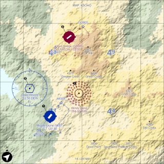

"Par Avion" Map
===============

A map generator for random VFR / IFR flight maps. In a nutshell it generates:

* Two or more airports
* One or more navigational aids, like VOR or NDB
* Zero or more obstacles like radio towers
* A topographical map

This generator can be used for simple civilian IFR flight simulators.

The generator takes two parameters:

1. A map size in Nautical Miles
1. Optional: A seed to generate the map from; identical seeds will generate identical maps

There is also a visible map painting on `<Canvas>`.



Usage
-----

```js
// Get yourself a randomizer
const randomizer = new Randomizer();
// Build locations
const locations = new LocationsMap(16, randomizer);
// Build terrain around locations
const terrain = new TerrainMap(locations, randomizer,4);
```

Demo
----

See https://fboes.github.io/par-avion-map/dist/ to have a whirl with the generator.

Data model
----------

The map consists of two layers:

1. [`LocationMap`](src/ParAvion/LocationMap.ts) contains points of interest, like airports and navigational beacons
2. [`TerrainMap`](src/ParAvion/TerrainMap.ts) contains the elevation data

The [`LocationMap`](src/ParAvion/LocationMap.ts) has multiple entities:

* [`Airport`](src/ParAvion/Airport.ts) including [`Runway`](src/ParAvion/Runway.ts) and  [`Waypoint`](src/ParAvion/Waypoint.ts)
* [`Navaid`](src/ParAvion/Navaid.ts) including [`HoldingPattern`](src/ParAvion/HoldingPattern.ts)
* [`Obstruction`](src/ParAvion/Obstruction.ts)
* [`Peak`](src/ParAvion/Obstruction.ts)

All of these entities use [`Coordinates`](src/Types/Coordinates.ts) calculated in Nautical Miles from the North-West corner of the map. The [`TerrainMap`](src/ParAvion/TerrainMap.ts) uses [`TerrainCoordinates`](src/Types/TerrainCoordinates.ts), which are fractions of Nautical Miles from the North-West corner, having a higher resolution for terrain data.

Legal stuff
-----------

Author: [Frank Boës](https://3960.org)

Copyright & license: See [LICENSE.txt](LICENSE.txt)
